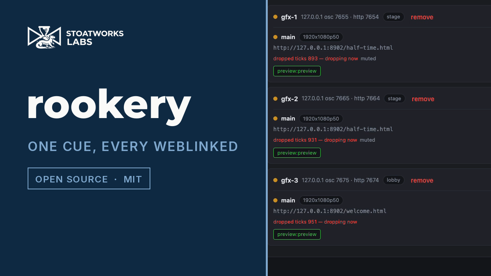
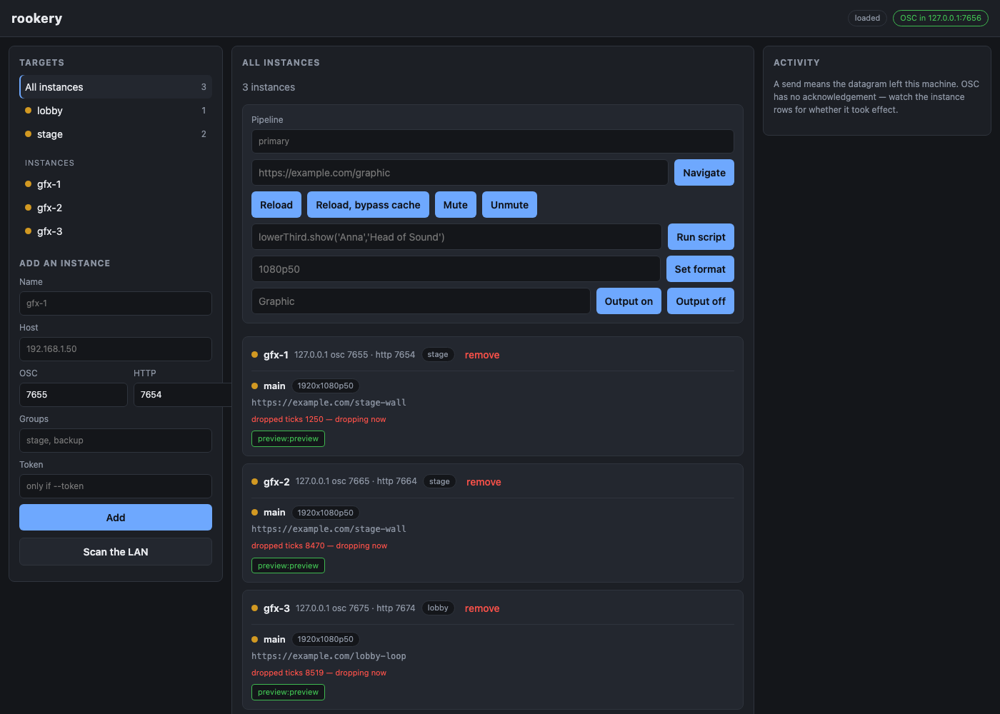

# rookery

> **AI-assisted project.** This codebase was created with
> [Claude](https://claude.com/claude-code) (Anthropic), directed and reviewed
> by a human author. Treat this as an early-stage hobby project: it has been
> exercised end-to-end against three real WebLinked instances on one machine —
> see [Status](#status) for exactly what that covers and what it does not.

One web UI for driving any number of
[WebLinked](https://github.com/stoatworks-labs/weblinked) instances at once.
Tag them into groups, see every instance's state on one screen, and change
what is on air across a whole group with one action — or one OSC cue from a
lighting desk.

A sibling to [flock](https://github.com/stoatworks-labs/flock), which does the
same job for BirdDog Play decoders.

[](https://www.youtube.com/watch?v=fMPwYG5TRAs)

*A 60-second tour: three real WebLinked 0.7.1 instances, two tagged `stage` and
one `lobby`, driven from rookery's own controls and by one OSC cue sent from
outside the browser. Not a mockup — and the amber dots are real: all three are
headless background processes, which macOS throttles, so they genuinely are
dropping ticks. See [Health](#health-what-the-dots-mean).*



<!-- Nothing hand-written goes between the downloads markers below.
     gen-downloads.py rewrites that whole block wholesale at every release and
     does not merge — prose put inside it is silently deleted. Put anything of
     your own above this comment or below downloads:end. -->

<!-- downloads:start -->

## Download

**[v0.1.0](https://github.com/stoatworks-labs/rookery/releases/tag/v0.1.0)** — prebuilt for macOS, Windows and Linux. Pick your platform:

<details>
<summary><b>macOS</b> — Apple Silicon, Intel</summary>

| Build | Download | Size |
| --- | --- | --- |
| Apple Silicon · .dmg disk image (CLI) | [`rookery-0.1.0-macos-aarch64-cli.dmg`](https://github.com/stoatworks-labs/rookery/releases/download/v0.1.0/rookery-0.1.0-macos-aarch64-cli.dmg) | 3.5 MB |
| Intel · .dmg disk image (CLI) | [`rookery-0.1.0-macos-x86_64-cli.dmg`](https://github.com/stoatworks-labs/rookery/releases/download/v0.1.0/rookery-0.1.0-macos-x86_64-cli.dmg) | 3.8 MB |
| Apple Silicon · .pkg installer (CLI) | [`rookery-0.1.0-macos-aarch64-cli.pkg`](https://github.com/stoatworks-labs/rookery/releases/download/v0.1.0/rookery-0.1.0-macos-aarch64-cli.pkg) | 3.1 MB |
| Intel · .pkg installer (CLI) | [`rookery-0.1.0-macos-x86_64-cli.pkg`](https://github.com/stoatworks-labs/rookery/releases/download/v0.1.0/rookery-0.1.0-macos-x86_64-cli.pkg) | 3.3 MB |
| Apple Silicon · .tar.gz archive | [`rookery-macos-aarch64.tar.gz`](https://github.com/stoatworks-labs/rookery/releases/latest/download/rookery-macos-aarch64.tar.gz) | 3.1 MB |
| Intel · .tar.gz archive | [`rookery-macos-x86_64.tar.gz`](https://github.com/stoatworks-labs/rookery/releases/latest/download/rookery-macos-x86_64.tar.gz) | 3.2 MB |

</details>

<details>
<summary><b>Windows</b> — x64, ARM64</summary>

| Build | Download | Size |
| --- | --- | --- |
| x64 · .exe installer | [`rookery-0.1.0-windows-x86_64-setup.exe`](https://github.com/stoatworks-labs/rookery/releases/download/v0.1.0/rookery-0.1.0-windows-x86_64-setup.exe) | 2.2 MB |
| ARM64 · .exe installer | [`rookery-0.1.0-windows-aarch64-setup.exe`](https://github.com/stoatworks-labs/rookery/releases/download/v0.1.0/rookery-0.1.0-windows-aarch64-setup.exe) | 2.0 MB |
| x64 · .zip archive | [`rookery-windows-x86_64.zip`](https://github.com/stoatworks-labs/rookery/releases/latest/download/rookery-windows-x86_64.zip) | 2.7 MB |
| ARM64 · .zip archive | [`rookery-windows-aarch64.zip`](https://github.com/stoatworks-labs/rookery/releases/latest/download/rookery-windows-aarch64.zip) | 2.6 MB |

</details>

<details>
<summary><b>Linux</b> — x64, ARM64</summary>

| Build | Download | Size |
| --- | --- | --- |
| x64 · .deb package (Debian/Ubuntu) | [`rookery_0.1.0_amd64.deb`](https://github.com/stoatworks-labs/rookery/releases/download/v0.1.0/rookery_0.1.0_amd64.deb) | 3.5 MB |
| ARM64 · .deb package (Debian/Ubuntu) | [`rookery_0.1.0_arm64.deb`](https://github.com/stoatworks-labs/rookery/releases/download/v0.1.0/rookery_0.1.0_arm64.deb) | 3.5 MB |
| x64 · .rpm package (Fedora/RHEL) | [`rookery-0.1.0-1.x86_64.rpm`](https://github.com/stoatworks-labs/rookery/releases/download/v0.1.0/rookery-0.1.0-1.x86_64.rpm) | 3.6 MB |
| ARM64 · .rpm package (Fedora/RHEL) | [`rookery-0.1.0-1.aarch64.rpm`](https://github.com/stoatworks-labs/rookery/releases/download/v0.1.0/rookery-0.1.0-1.aarch64.rpm) | 3.6 MB |
| x64 · .tar.gz archive | [`rookery-linux-x86_64.tar.gz`](https://github.com/stoatworks-labs/rookery/releases/latest/download/rookery-linux-x86_64.tar.gz) | 3.4 MB |
| ARM64 · .tar.gz archive | [`rookery-linux-aarch64.tar.gz`](https://github.com/stoatworks-labs/rookery/releases/latest/download/rookery-linux-aarch64.tar.gz) | 3.4 MB |

</details>

All builds, checksums and release notes: [github.com/stoatworks-labs/rookery/releases](https://github.com/stoatworks-labs/rookery/releases).

macOS builds are signed and notarised and open normally. The Windows builds are unsigned, so SmartScreen warns once.

<!-- downloads:end -->

## Why

WebLinked already has a good control page and a
[Companion module](https://github.com/stoatworks-labs/companion-module-weblinked).
Both drive **one instance**. The moment a show has six machines pushing
graphics to six screens, you have six browser tabs, and "change the lower
third on every stage machine" is six actions performed in sequence by
somebody who has to get all six right.

rookery makes that one action, and shows you all six at once while you do it.

## What it does

- **Groups from tags.** An instance can be in as many groups as you like;
  there is no group object to maintain. Membership is resolved when a command
  is sent, so retagging takes effect on the next cue.
- **Fan-out over OSC.** Every WebLinked verb — navigate, reload, run a script
  in the page, mute, set the raster, start or stop a named output — aimed at
  one instance, one group, or everything.
- **A real dashboard.** Each instance is polled over its HTTP API, so you can
  see what each one is actually showing, which outputs are running, how many
  NDI receivers are attached, and whether the clock is keeping up.
- **Northbound OSC.** A desk, a QLab cue or a Companion button can drive the
  whole fleet: `/rookery/group/stage/url`. The verbs are WebLinked's own, so
  an existing button is retargeted by editing the front of the address.
- **Multi-source aware.** WebLinked can run several independent pipelines in
  one process; rookery can address one of them across a whole group.
- **Discovery.** An active subnet probe for WebLinked's control API, since
  WebLinked does not advertise itself.

## Quick start

```bash
cargo build --release
cp config/example.toml config/rookery.toml
./target/release/rookery config/rookery.toml
```

Then open <http://127.0.0.1:8090>, add an instance by hostname, and give it a
group tag.

### The one thing that will catch you out

**WebLinked binds its HTTP server to `127.0.0.1` by default.** Start each
instance with `--bind 0.0.0.0` or rookery cannot poll it:

```bash
weblinked --url https://example.com --ndi=Graphic --bind 0.0.0.0
```

Without that, commands go out fine — WebLinked's OSC listener is on
`0.0.0.0` already — and no state ever comes back. The instance shows as
unreachable while quietly doing everything you tell it. rookery reports that
honestly rather than guessing, but it is worth knowing before you go looking
for a network fault that isn't there.

## Sending a command

Everything the UI does is available over HTTP:

```bash
# One group
curl -X POST -H 'Content-Type: application/json' \
  -d '{"verb":"url","url":"https://graphics.local/lower-third"}' \
  http://127.0.0.1:8090/api/groups/stage/send

# Everything, calling a function the page already defines
curl -X POST -H 'Content-Type: application/json' \
  -d '{"verb":"script","script":"lowerThird.hide()"}' \
  http://127.0.0.1:8090/api/all/send

# One pipeline inside a multi-source instance
curl -X POST -H 'Content-Type: application/json' \
  -d '{"verb":"reload","ignore_cache":true,"source":"lower-third"}' \
  http://127.0.0.1:8090/api/groups/stage/send
```

The response is always the per-instance breakdown, never a single ok:

```json
{
  "target": "group \"stage\"",
  "command": "url https://graphics.local/lower-third",
  "entries": [
    { "instance_name": "gfx-1", "sent": true,  "error": null },
    { "instance_name": "gfx-2", "sent": false, "error": "cannot resolve gfx-2.local:7655" }
  ]
}
```

## Driving it from a desk

Enable the northbound listener in `config/rookery.toml`:

```toml
osc_bind = "0.0.0.0:7656"
```

```
/rookery/all/<verb>
/rookery/group/<tag>/<verb>
/rookery/instance/<name-or-id>/<verb>
/rookery/group/<tag>/source/<source-id>/<verb>
```

The verbs are WebLinked's, unchanged — `url`, `reload`, `script`, `mute`,
`format`, `output/<name>` — so a Companion button already aimed at one
WebLinked becomes a whole-group button by editing the front of the address:

```
before:  /weblinked/source/lower-third/output/Graphic
after:   /rookery/group/stage/source/lower-third/output/Graphic
```

Full grammar and the reasoning in [docs/protocol.md](docs/protocol.md).

## A send is not a confirmation

This is the design fact worth internalising before relying on rookery.

OSC over UDP has no acknowledgement, and WebLinked sends nothing back. So
when rookery says a command was **sent**, it means exactly one thing: *the
datagram left this machine*. It does not mean the instance received it,
parsed it, or acted on it.

That is why rookery polls every instance's HTTP API. **The dashboard is the
confirmation, not the send.** Nothing in the UI or the API presents a
successful send as a confirmed change, and it never will — the network cannot
support the claim.

## Health: what the dots mean

| Dot | Means |
|---|---|
| green | Running, no output errors, keeping up with its clock |
| amber | Dropping ticks **right now**, or an output that is enabled but not running |
| red | An output reported an error — a card in use, a format it cannot do |
| grey (stopped) | The source is not running |
| grey (unknown) | Not polled, or not yet heard from. Never guessed at |

**"Dropping ticks right now" is a delta, not a total.** WebLinked's
`dropped_ticks` is cumulative since it started, and a healthy instance
accumulates them — a real one measured here sat at 346 out of 2205 and
climbing, purely because macOS throttles a backgrounded process. Colouring on
the total would paint every mature instance permanently amber, and an
indicator that is always amber tells an operator nothing. rookery compares
successive polls instead.

## Security

**rookery has no authentication, and neither does the thing it drives.**

WebLinked's OSC listener accepts commands from anyone who can reach UDP 7655
— that is the protocol, not a choice either project made. Its `--token` only
covers the HTTP API. Putting a login on rookery alone would look like
protection it cannot provide, so there isn't one.

Treat rookery, its northbound OSC port, and every instance it manages as one
trust domain, and put that domain on a show network that untrusted machines
cannot reach. Do not expose any of it to the internet.

Instance tokens *are* encrypted at rest (AES-256-GCM, key in
`credentials.key` beside the registry), so `registry.json` in a backup or a
synced folder does not hand over your fleet.

An optional shared login for rookery's own UI — flock has one — is the
obvious next addition; it is not here yet.

## Status

**Verified against real hardware-free WebLinked instances**, 2026-08-10:
three real WebLinked 0.7.1 processes on macOS. Confirmed working end to end:
state polling, `url` (including the 3-mod-4 length that WebLinked's own
decoder used to drop silently), `mute`, `format`, `output`, `script` (proven
to *execute*, not merely arrive), group fan-out reaching exactly its members,
and the full northbound chain driven by an independent OSC encoder written
from the spec rather than from rookery's own.

**Not verified:** anything off this machine — everything above was loopback,
so no real show network, switch or VLAN has been involved. Also unverified:
discovery against a real LAN, Windows and Linux (never built or run), scale
beyond three instances, a token-protected real instance, and multi-source
addressing against real WebLinked rather than the simulator.

[docs/verification.md](docs/verification.md) is the authority and says
precisely which is which. It is deliberately more pessimistic than this
summary.

## Documentation

| Document | What |
|---|---|
| [docs/protocol.md](docs/protocol.md) | Both OSC surfaces, the HTTP state path, and the padding rule that has already cost this fleet a shipped bug |
| [docs/verification.md](docs/verification.md) | What has actually been run, against what |
| [AGENTS.md](AGENTS.md) | The model and the traps, for a new contributor or an LLM |
| [CLAUDE.md](CLAUDE.md) | Command reference |

## Licence

MIT — see [LICENSE](LICENSE). Attributions in
[ATTRIBUTIONS.md](ATTRIBUTIONS.md).
